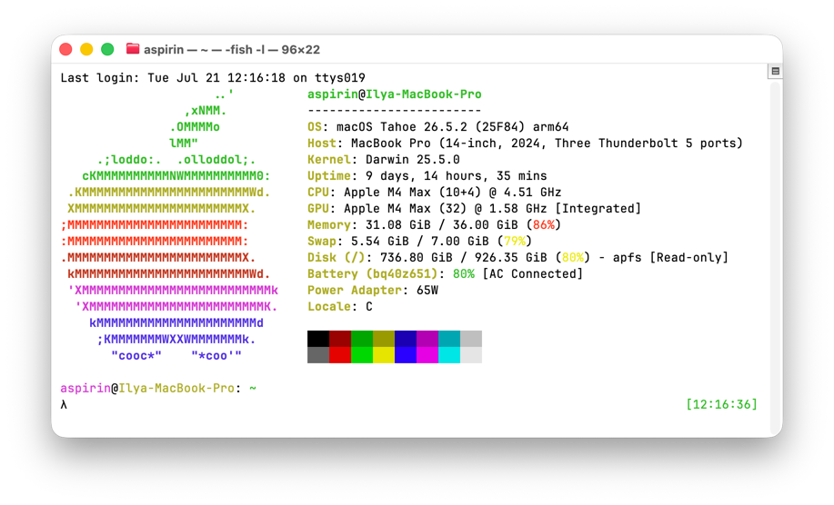
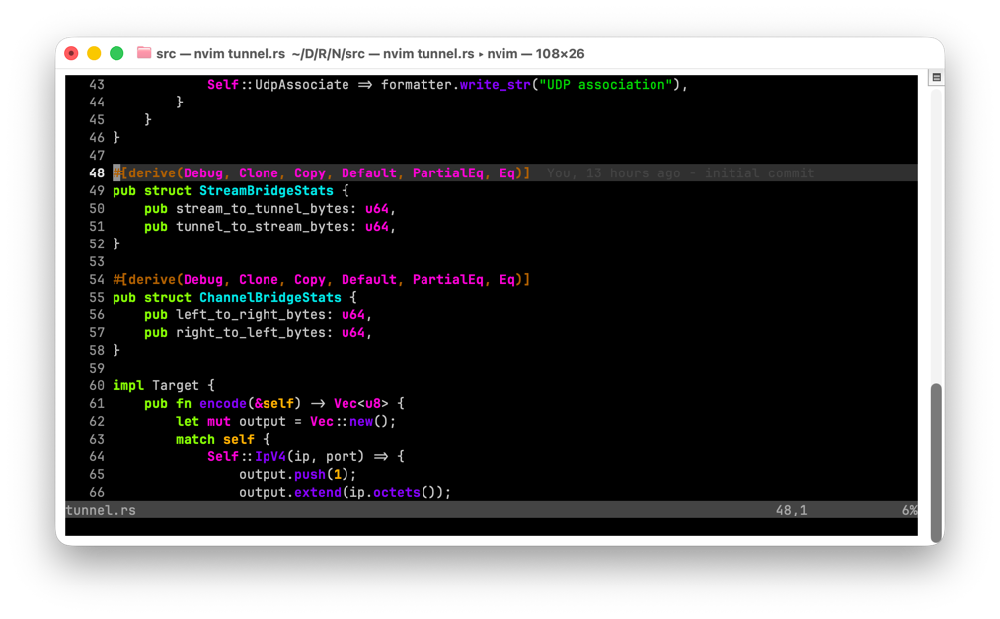

# dotfiles

My personal dotfiles. 

In git history you can found how my setup was changed.





## install

```sh
./install.sh
```

This script will backup your configs and replace them with symlinks to that repo.
